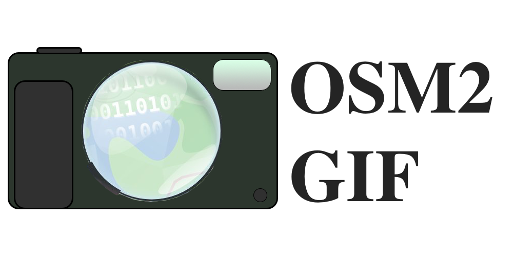

Turns `.osm`, `.osm.pbf`, `.osh.pbf`, and `.csv` files into animated GIFs of mapping activity.  `.csv` files must follow the format:

**`id`, `lon`, `lat`, {[`user`:`timestamp`],[`user`:`timestamp`] ... }**

Where each [`user`:`timestamp`] duple represents an individual edit instance of the node at that location.  Currently ways and relations are not supported for `.csv` files.

Currently frame generation works for `.csv` but `.gif` creation from those frames remains unfinished.  Moreover, there are problems with server rejection for excessive tile server requests.  `.osm`, `.osh.pbf`, and `.osm.pbf` file parsing code remains untested, but is likely fairly close to finished as it is based on some functional code I previously wrote for another poject.  Also, current `.gif` creation fails to create frames for days without any activity, so that is a problem that remains to be fixed.

# Dependencies (pip)

* [pyosmium](https://github.com/osmcode/pyosmium)
* [staticmap](https://github.com/komoot/staticmap)
* [imageio](https://imageio.github.io)
* [images2gif](https://pypi.python.org/pypi/images2gif)
